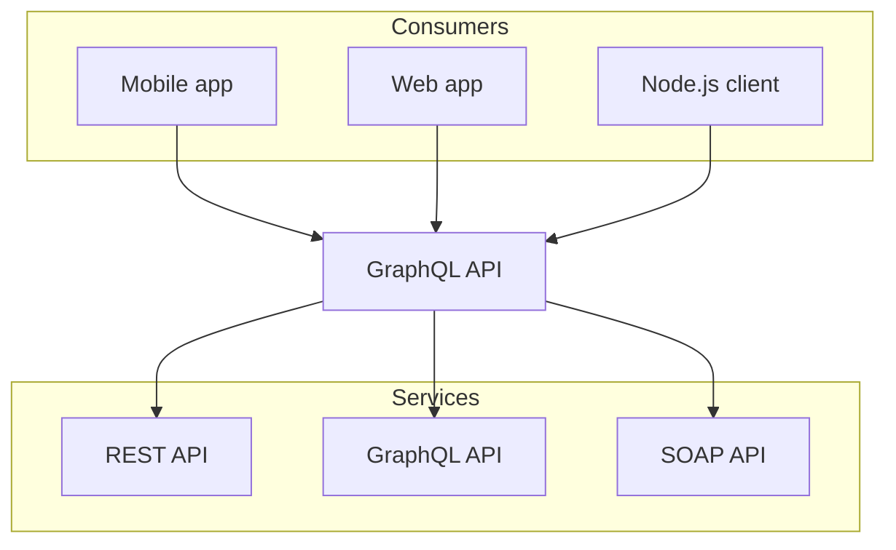

import { Callout } from 'nextra/components';

### Routing

<Callout emoji="🌌">
    You Say Never Let Me Go\~
</Callout>

Routing 的中文经常被翻译为路由。路由这个词在计算机网络中，指的是一种将某个特定的数据包从起点经过一定的路径到达终点，路（径经）由在这里指的是寻路的方式。而在前端中，用户输入一个网址，网站需要做的就是通过网址的信息，将其对应界面返回给用户，这个过程就是 Routing。

对于用户的一些特殊需求（其中有一些可能不是预料中的），进行路由就相当具有必要性了。以下是一些场景：

- 用户输入的网址不存在：需要返回 404 页面。在这里，路由更多地倾向于寻找合适的页面；
- 用户意外地访问到了你不太想被访问到的页面：需要返回一个不存在权限的提示界面。这里，路由能够对用户进行权限的限制，从而保证网页的安全性；

从上面的例子中，我们可以总结出 Routing 在网页中的作用:
1. 寻找合适的页面；
2. 对用户进行权限的限制；
3. 保证网页的安全性；[^1]




The **Pythagorean equation**: $a=\sqrt{b^2 + c^2}$.

```js copy showLineNumbers
const a = 1;
```

| left   | center | right |
| :----- | :----: | ----: |
| foo    |  bar   |   baz |
| banana | apple  |  kiwi |

[^1]: [Next.js 的 Routing 文档](https://nextjs.org/docs/app/building-your-application/routing)

### Next.js 的文件组织形式


为了了解 Routing 的原理，我们需要先了解 Next.js 的文件组织形式。在 Next.js v13 中，一个典型的项目包括：
- `app`： 

文件夹的组织形式常常可以表示为树形结构，Next.js 中的这些文件形式都将

由上面的组织形式可以看出，Next.js v13 之后版本的 Routing 都是在 `app` 文件夹之间进行的。因此，Next.js 引入的这个新机制被称为 `App` Routing。


### Reference

